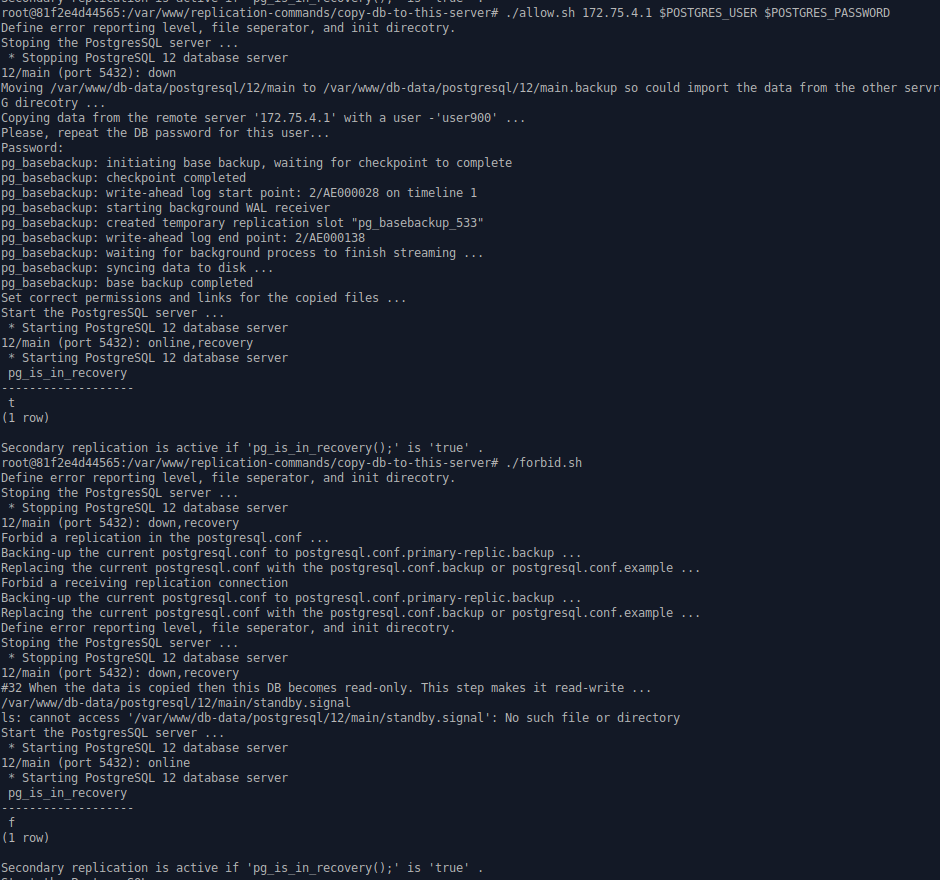

# copy-db-to-this-server

  

## How to copy data from another server without losing any data?

> NB! First ON THAT ANOTHER SERVER EXECUTE `copy-db-from-this-server/allow.sh` to allow copying from it.

## Execute here `allow.sh`

```shell
./allow.sh 172.75.4.1 $POSTGRES_USER $POSTGRES_PASSWORD
```

* It will ask again the password.
* Wait till it finishes copying the data.
* Now the replication is working - data is synced with that other server. Every changes on it will appear on this DB.
* But that's not all! The current DB is not writable right now (for safety reasons).

### To allow the write You need to

Execute this:

```shell
/forbid.sh
```

* And maybe even stop (or restart if You wish to use it further) that other server. 